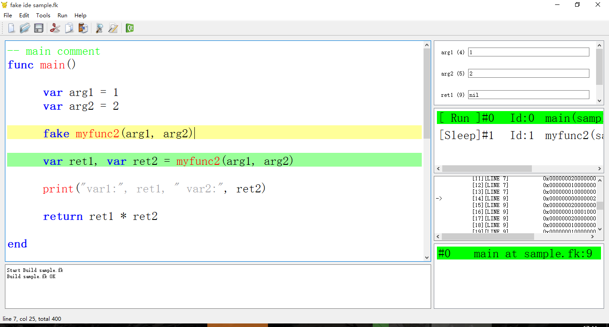
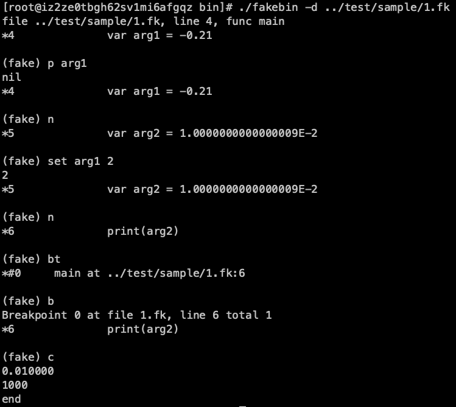

# fake

[](https://github.com/esrrhs/fake)
[](https://github.com/esrrhs/fake)
[](https://github.com/esrrhs/fake)
[](https://travis-ci.org/esrrhs/fake)
[](https://lgtm.com/projects/g/esrrhs/fake/context:cpp)
[](https://www.codacy.com/manual/esrrhs/fake?utm_source=github.com&amp;utm_medium=referral&amp;utm_content=esrrhs/fake&amp;utm_campaign=Badge_Grade)

轻量级嵌入式脚本语言

[README_EN](./README_EN.md)

## 简介
**fake**是一款轻量级的嵌入式脚本语言, 使用c++语言编写, 语法吸取自lua、golang、erlang, 基于flex、bison生成语法树, 编译成字节码解释执行。

## 脚本特性
* 运行环境linux amd64、MacOS amd64
* 支持VM, JIT(实验性质)
* 支持fake testfunc(param1)产生routine, 在单线程上实现多线程效果(此特性不支持JIT)
* 支持调试, 自带gdb风格的命令行调试器, 以及VS风格的可视化编辑调试ide, 也可在C里直接通过接口调用, 开始命令行调试
* 支持热更新
* 支持C风格函数和C++类成员函数的绑定
* 支持profile, 可获取脚本各个函数运行时间
* 支持array, map, 可以无限嵌套
* 支持多返回值
* 支持Int64
* 支持const定义
* 支持包
* 支持struct
* 支持打包bin文件或可执行文件

## 产品应用
[疯狂炸翻天](https://www.muzhiwan.com/com.fkzft.gamewin.mzw.html)
[我是大主宰](http://dzz.youxi.com)
[天天炫斗](http://ttxd.qq.com/act/a20160419brandP/)

## 示例

```


-- 当前包名
package mypackage.test

-- 引入的文件
include "common.fk"

-- 结构体定义
struct teststruct
	sample_a
	sample_b
	sample_c
end

-- 常量值
const hellostring = "hello"
const helloint = 1234
const hellomap = {1 : "a" 2 : "b" 3 : [1 2 3]}

-- func1 comment
func myfunc1(arg1, arg2)
	
	-- C函数和类成员函数的调用
	arg3 := cfunc1(helloint) + arg2:memfunc1(arg1)
	
	-- 分支
	if arg1 < arg2 then	
		-- 创建一个协程
		fake myfunc2(arg1, arg2)
	elseif arg1 == arg2 then	
		print("elseif")
	else
		print("else")
	end
	
	-- for循环
	for var i = 0, i < arg2, i++ then
		print("i = ", i)
	end
	
	-- 数组
	var a = array()
	a[1] = 3
	
	-- 集合
	var b = map()
	b[a] = 1
	b[1] = a
	
	-- Int64
	var uid = 1241515236123614u
	log("uid = ", uid)

	-- 子函数调用
	var ret1, var ret2 = myfunc2()

	-- 其他包的函数调用
	ret1 = otherpackage.test.myfunc1(arg1, arg2)
	
	-- 结构体
	var tt = teststruct()
	tt->sample_a = 1
	tt->sample_b = teststruct()
	tt->sample_b->sample_a = 10

	-- 分支
	switch arg1
		case 1 then
			print("1")
		case "a" then
			print("a")
		default
			print("default")
	end

	-- 多返回值
	return arg1, arg3
	
end
```

## C++示例

```
// 创建一个实例
fake * fk = newfake();
// 注册全局函数
fkreg(fk, "cfunc1", cfunc1);
// 注册类成员函数, 不同的类注册一样的函数名字不冲突
fkreg(fk, "memfunc1", &class1::memfunc1);
// 解析fake脚本文件
fkparse(fk, argv[1]);
// 执行myfunc1函数, 传入两个参数分别为1和2
ret = fkrun<int>(fk, "myfunc1", 1, 2);
// 删除实例
delfake(fk);
```


## 性能比较
运行```cd benchmark/ && ./benchmark.sh```
,在MacBook Pro 2.3 GHz Intel Core i5上的数据

|       | Lua   | Python |  Fake | Fake JIT |
|-------|-------|:------:|------:|----------|
| Loop  | 0.8s  |  2.3s  |  1.3s | 0.2s     |
| Prime | 13.5s |  20.9s | 12.8s | 5.9s     |
| String | 0.8s |  0.4s | 1.2s | 3.2s     |

注：因为JIT目前无法GC，所以String反而最慢

## 如何使用
复制 include/**fake-inc.h** 和 bin/**libfake.so** 到你的工程, 直接使用


## 如何编译
1. 安装cmake
2. (可选)安装flex, bison, 运行```./gen.sh```
3. 安装gcc, gcc-c++
4. ```./build.sh``` 或者 ```./build.sh release```

## 测试示例
1. test/sample 目录下有脚本示例代码
2. 运行方法 ```cd test && ./test.sh```
3. bin/fakebin 为可执行文件，可以自己编写运行，如：```./fakebin your.fk```


## 调试环境
* IDE **（bin/fakeide.app）**



* 命令行 **（bin/fakebin）**



## Stargazers over time

[](https://starchart.cc/esrrhs/fake)
      
